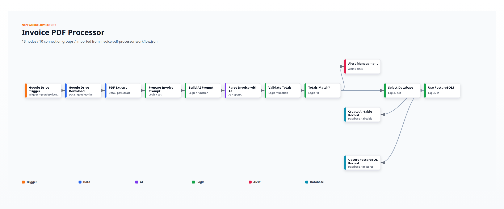
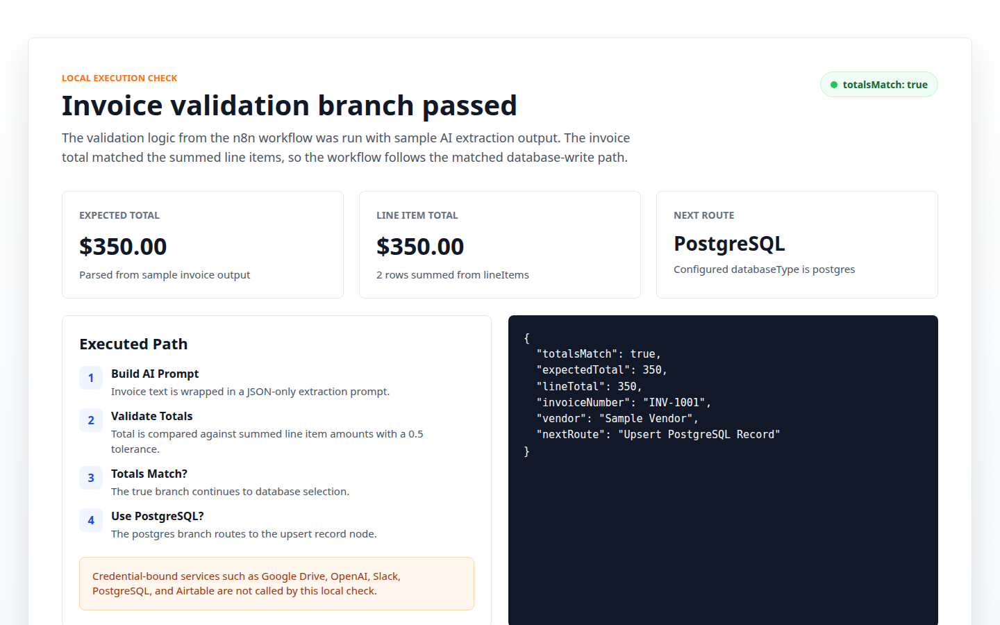

# The_Automated_Financial_Invoice_Processor

This repository contains an n8n workflow that triggers when a new invoice PDF is added to Google Drive, performs OCR/AI extraction of line-item data, updates a database record in Airtable or PostgreSQL, and alerts management when invoice totals do not match.

## Screenshots

### Workflow overview



### Execution validation



## Added workflow

- `invoice-pdf-processor-workflow.json`: n8n workflow export for invoice processing.

## Setup

1. Import `invoice-pdf-processor-workflow.json` into n8n.
2. Configure the following credentials in n8n:
   - Google Drive OAuth2
   - OpenAI API Key
   - Slack API
   - Airtable API (optional)
   - PostgreSQL (optional)
3. Update the `Google Drive Trigger` node with the target folder ID.
4. Choose the database type by editing the `databaseType` field in the `Prepare Invoice Prompt` node to either `postgres` or `airtable`.
5. Enable and activate the workflow.

## Workflow files

- `invoice-pdf-processor-workflow.json`: Original n8n export.
- `invoice-pdf-processor-workflow.yaml`: Runnable YAML version for n8n import or version control.
- `scripts/render-screenshots.js`: Generates the README screenshots from the checked-in workflow export.

## Behavior

- Watches a Google Drive folder for new invoice PDFs.
- Downloads the PDF and uses OCR to extract text.
- Sends invoice text to OpenAI to parse invoice fields and line items.
- Validates whether the invoice total matches the sum of line items.
- Writes parsed invoice data to PostgreSQL or Airtable.
- Sends a Slack alert to management when totals do not match.

## Verification

- The workflow JSON parses successfully and all connection targets resolve to existing nodes.
- The invoice total validation logic was executed locally with sample AI extraction output.
- Full live execution in n8n requires configured Google Drive, OpenAI, Slack, and PostgreSQL or Airtable credentials.

Regenerate the screenshots with:

```bash
node scripts/render-screenshots.js
```
